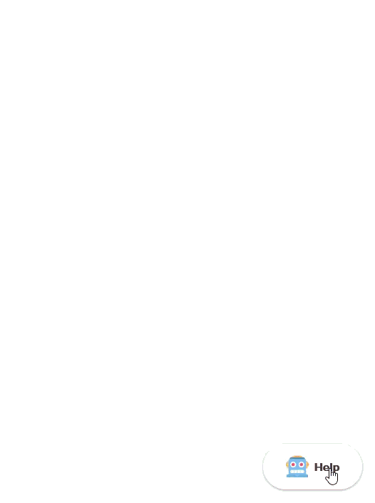

# Customisable DigitalOcean Chatbot Widget

The [DigitalOcean AI Chatbot](https://www.digitalocean.com/community/tutorials/build-ai-agent-chatbot-with-gradient-platform) is an excellent front-end to an excellent backend system.

Although it's designed as a drop-in tool to save users building a complete chat system, but basic customisations aren't implemented.

This repository is a fork of the DigitalOcean Chatbot agent, with multiple options, namely:

 - Button Placement (select where you want the widget) + fine-tuning options
 - Button Text (Add text to the button)
 - Automatic translations on button text
 - Responsive Button

 

## Table of Contents

- [Quick Start](#quick-start)
- [Installation](#installation)
- [Configuration Options](#configuration-options)
- [Examples](#examples)
- [Advanced Usage](#advanced-usage)
- [Troubleshooting](#troubleshooting)

## Quick Start

You need to upload the script to your host / hosting platform.

Add the following script tag to your HTML file, typically just before the closing `</body>` tag:

```html
<script async
  src="path/to/widget.js"
  data-api-url="https://YOUR_AGENT_URL.agents.do-ai.run"
  data-agent-id="your-agent-id"
  data-chatbot-id="your-chatbot-id"
  data-name="My Chatbot">
</script>
```

## Installation

### Full Featured Embed

For a fully customized chatbot experience:

```html
<script async
  src="path/to/widget.js"
  data-api-url="https://YOUR_AGENT_URL.agents.do-ai.run"
  data-agent-id="your-agent-id"
  data-chatbot-id="your-chatbot-id"
  data-name="Customer Support Bot"
  data-primary-color="#f5f5f5"
  data-secondary-color="#ffffff"
  data-button-background-color="#2c6ee7"
  data-button-text-color="#ffffff"
  data-starting-message="Hello! How can I help you today?"
  data-logo="https://your-domain.com/logo.svg"
  data-button-location="bottom-right"
  data-button-padding-x="20"
  data-button-padding-y="20"
  data-button-text="Help"
  data-button-text-translations='{"en":"Help","es":"Ayuda","fr":"Aide"}'>
</script>
```

## Configuration Options

### Required Attributes

| Attribute | Type | Description |
|----------|------|-------------|
| `data-api-url` | String | The full API URL from your DigitalOcean Control Panel (Typically in the format of https://YOUR_AGENT_URL.agents.do-ai.run)  |
| `data-chatbot-id` | String | The Chatbot ID from the DigitalOcean Control Panel
| `data-agent-id` | String | The Agent ID from the DigitalOcean Control Panel |

### Optional Attributes

#### Visual Customization

| Attribute | Type | Default | Description |
|----------|------|---------|-------------|
| `data-name` | String | - | Display name for the chatbot. |
| `data-primary-color` | String (hex) | - | Primary color for the chatbot interface. |
| `data-secondary-color` | String (hex) | - | Secondary color for the chatbot interface. |
| `data-button-background-color` | String (hex) | - | Background color for the chat button. |
| `data-button-text-color` | String (hex) | - | Text color for the chat button. |
| `data-logo` | String (URL) | - | URL to the chatbot logo image (SVG, PNG, etc.). |

#### Content Customization

| Attribute | Type | Default | Description |
|----------|------|---------|-------------|
| `data-starting-message` | String | - | Initial message displayed when the chatbot opens. Supports multi-line text. |
| `data-button-text` | String | "" | Text label displayed on the chat button (e.g., "Help", "Chat", "Support"). |
| `data-button-text-translations` | JSON String | "" | JSON object containing translations for button text. Keys are language codes (e.g., "en", "es", "fr"). |

#### Positioning & Layout

| Attribute | Type | Default | Description |
|----------|------|---------|-------------|
| `data-button-location` | String | "bottom-right" | Position of the chat button. Options: `bottom-left`, `bottom-center`, `bottom-right`, `top-left`, `top-center`, `top-right`. |
| `data-button-padding-x` | String (number) | "0" | Horizontal padding (in pixels) from the edge of the viewport. |
| `data-button-padding-y` | String (number) | "0" | Vertical padding (in pixels) from the edge of the viewport. |
| `data-render-target-id` | String | - | ID of an HTML element where the chatbot should be rendered inline (instead of as a floating button). |

## Examples

### Example 1: Multi-language Support

```html
<script async
  src="https://your-domain.com/chatbot/widget.js"
  data-api-url="https://api.example.com"
  data-chatbot-id="abc123"
  data-agent-id="agent-456"
  data-button-text="Help"
  data-button-text-translations='{"en":"Help","es":"Ayuda","fr":"Aide","de":"Hilfe","it":"Aiuto","pt":"Ajuda","ja":"ヘルプ","zh":"帮助","ko":"도�말","ru":"Помощь","ar":"مساعدة","nl":"Hulp","sv":"Hjälp","pl":"Pomoc","hi":"मदद"}'>
</script>
```

The button text will automatically display in the user's browser language if a translation is available.

### Example 2: Custom Position with Padding

```html
<script async
  src="path/to/widget.js"
  data-api-url="https://YOUR_AGENT_URL.agents.do-ai.run"
  data-agent-id="your-agent-id"
  data-chatbot-id="your-chatbot-id"
  data-button-location="bottom-left"
  data-button-padding-x="40"
  data-button-padding-y="40">
</script>
```

This positions the chatbot button in the bottom-left corner with 40px padding from both edges.

### Example 3: Welcome Message

```html
<script async
  src="path/to/widget.js"
  data-api-url="https://YOUR_AGENT_URL.agents.do-ai.run"
  data-agent-id="your-agent-id"
  data-chatbot-id="your-chatbot-id"
  data-starting-message="Welcome to our support chat! I'm here to help answer your questions about our products and services. How can I assist you today?">
</script>
```

This displays a custom welcome message when users open the chatbot.

### Example 4: Inline Embedded Chatbot

```html
<div id="chat-container" style="width: 100%; height: 600px;"></div>

<script async
  src="path/to/widget.js"
  data-api-url="https://YOUR_AGENT_URL.agents.do-ai.run"
  data-agent-id="your-agent-id"
  data-chatbot-id="your-chatbot-id"
  data-render-target-id="chat-container">
</script>
```

This embeds the chatbot directly into a specific container element instead of showing it as a floating button.


## Advanced Usage

### Button Text Translations

The `data-button-text-translations` attribute accepts a JSON string with language codes as keys. The widget automatically detects the user's browser language and displays the appropriate translation.

Supported format:
```json
{
  "en": "Help",
  "es": "Ayuda",
  "fr": "Aide",
  "de": "Hilfe",
  "it": "Aiuto",
  "pt": "Ajuda",
  "ja": "ヘルプ",
  "zh": "帮助",
  "ko": "도욀말",
  "ru": "Помощь",
  "ar": "مساعدة",
  "nl": "Hulp",
  "sv": "Hjälp",
  "pl": "Pomoc",
  "hi": "मदद"
}
```

The widget uses the primary language code (e.g., "en" from "en-US") to match translations.

### Multi-line Starting Messages

The `data-starting-message` attribute supports multi-line text. Simply include line breaks in your message:

```html
data-starting-message="You're interacting with an AI agent, specifically trained on our knowledge-base and FAQs.
It is designed to give rapid answers to pre-sale questions that you may have. It is NOT designed to replace our human support team.

If you have questions that relate to an order you've already made, or want to interact directly with our support team, please send us an email.
```

### Inline vs Floating Mode

**Floating Mode (Default):**
- The chatbot appears as a button that expands into a chat window
- Positioned using `data-button-location` and padding attributes
- Overlays the page content with `z-index: 9999`

**Inline Mode:**
- Set `data-render-target-id` to embed the chatbot in a specific container
- The chatbot fills the container's dimensions (100% width and height)
- No floating button; the chat interface is always visible
- Useful for dedicated support pages or dashboard integrations

### Dynamic Sizing

The widget automatically calculates button dimensions based on:
- Icon size (64px)
- Button text length (approximately 8px per character)
- Padding (32px total)

When expanded, the chatbot adapts to viewport size with:
- Maximum width: `calc(100vw - 24px)` (collapsed) or `100vw` (expanded)
- Maximum height: `calc(100vh - 24px)` (collapsed) or `100vh` (expanded)

### External Link Handling

When the chatbot needs to open external links, they are opened in a new browser tab/window using `window.open(url, "_blank")`.

### Click-Outside to Close

In floating mode, clicking anywhere outside the chatbot iframe will automatically close the chat window. This behavior is disabled in inline mode.

## Troubleshooting

### Chatbot Not Appearing

1. **Check Permissions**: Your agent must be set to **public** in the DigitalOcean control panel.
2. **Check Domain Whitelist**: The Agent's domain whitelist is for the domains that the chatbot is __embedded on__ - not the domain it is hosted on!
3. **Check script URL**: Ensure the `src` attribute points to the correct `widget.js` file
4. **Verify required attributes**: Confirm `data-api-url`, `data-chatbot-id`, and `data-agent-id` are set
5. **Check browser console**: Look for JavaScript errors or network issues�4. **API URL**: If `data-api-url` is not provided, it defaults to the origin of the script source

### Button Text Not Translating

1. **Check JSON format**: Ensure `data-button-text-translations` contains valid JSON
2. **Language code**: Verify the user's browser language code is included in your translations
3. **Fallback**: If no translation is found, the widget uses the value from `data-button-text`


## License

The original code does NOT have an included license.
In its absence, this code is distributed under GPLv3.

## Support

Please feel free to fork and make contributions.